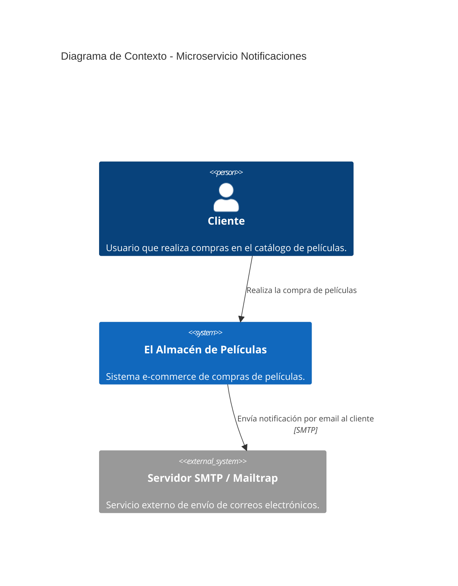
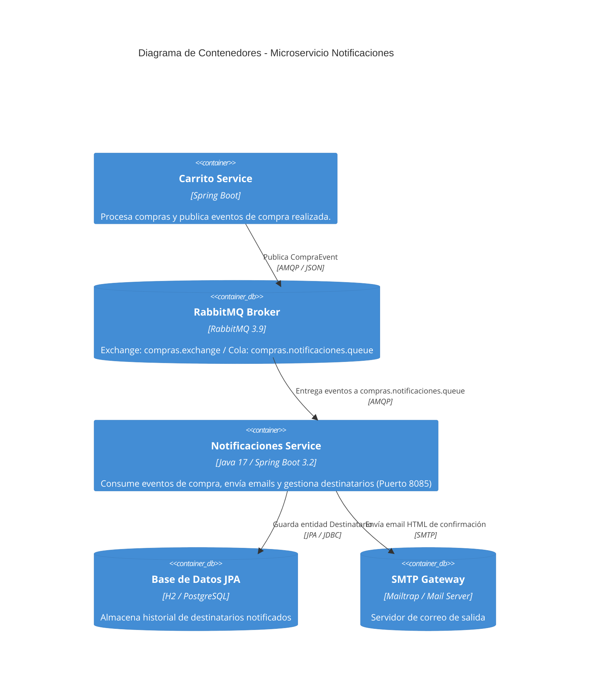
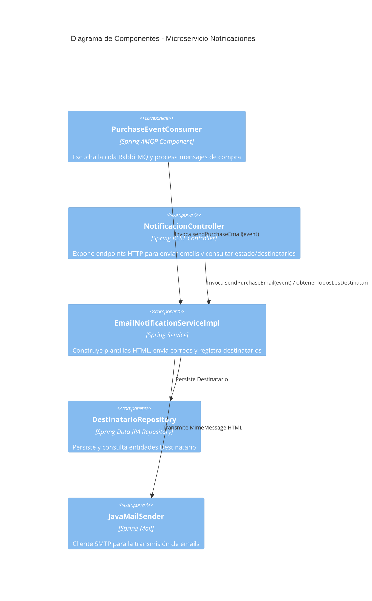

# Vertical Notificaciones - Microservicio Backend

Este microservicio forma parte del sistema **El Almacén de Películas Online** y es el componente encargado de procesar y enviar notificaciones por correo electrónico a los clientes tras la realización de compras.

---

## 🎯 1. Propósito y Visión General

El microservicio `notificaciones` da cumplimiento a los requerimientos del sistema:
- **RF-10 (Envío de email de compra)**: Cada compra realizada por un cliente activa el envío de un correo electrónico en formato HTML detallando los productos adquiridos, cantidades, precios unitarios, subtotal y monto total abonado.
- **RT-8 (Vertical de Notificaciones asincrónico)**: Implementa un vertical específico y desacoplado que reacciona asincrónicamente a los eventos transmitidos mediante **RabbitMQ** cuando se confirman compras en el sistema.

### Funcionalidades Principales
1. **Consumo de Eventos de Compra**: Escucha la cola de mensajería RabbitMQ `compras.notificaciones.queue` vinculada a la clave de enrutamiento `compras.realizadas.routing-key`.
2. **Generación y Envío de Emails HTML**: Construye dinámicamente un correo electrónico con plantilla HTML profesional detallada utilizando Spring Mail (`JavaMailSender`).
3. **Persistencia y Registro de Destinatarios**: Almacena el historial de destinatarios notificados en la base de datos JPA para auditoría.
4. **API HTTP REST de Gestión y Diagnóstico**: Expone endpoints REST para consultar la salud del servicio, consultar el listado de destinatarios notificados y desencadenar envíos manuales vía HTTP.

---

## 📡 2. Servicios Expuestos vía HTTP (API REST)

Base URL: `http://localhost:8085/api/notificaciones`

| Método | Endpoint | Descripción | Estado HTTP |
| :--- | :--- | :--- | :--- |
| `POST` | `/api/notificaciones/enviar` | Desencadena manualmente el envío de una notificación por email recibiendo el evento de compra en el cuerpo de la petición. | `200 OK` / `500 Internal Error` |
| `GET` | `/api/notificaciones/destinatarios` | Obtiene la lista completa de destinatarios registrados a los que se les envió una notificación de compra. | `200 OK` |
| `GET` | `/api/notificaciones/health` | Endpoint de verificación de estado y salud del microservicio. | `200 OK` |

### 📝 Estructura de DTOs / Payloads

#### Evento de Compra (`POST /api/notificaciones/enviar` y payload de RabbitMQ)
```json
{
  "idCompra": "compra-10294",
  "fecha": "2026-07-22T21:00:00",
  "emailCliente": "cliente@ejemplo.com",
  "nombreCliente": "Juan Pérez",
  "productos": [
    {
      "idProducto": "pel-10",
      "nombre": "Inception",
      "cantidad": 2,
      "precioUnitario": 1500.00,
      "subtotal": 3000.00
    },
    {
      "idProducto": "pel-12",
      "nombre": "The Dark Knight",
      "cantidad": 1,
      "precioUnitario": 1800.00,
      "subtotal": 1800.00
    }
  ],
  "total": 4800.00
}
```

#### Respuesta de Envío HTTP (`POST /api/notificaciones/enviar`)
```json
{
  "message": "Notificación enviada exitosamente",
  "idCompra": "compra-10294",
  "emailCliente": "cliente@ejemplo.com"
}
```

#### Respuesta de Estado (`GET /api/notificaciones/health`)
```json
{
  "status": "UP",
  "service": "notificaciones"
}
```

---

## 🔄 3. Eventos Publicados y Consumidos

### Modelo de Integración por Mensajería (RabbitMQ)

- **Exchange**: `compras.exchange` (TopicExchange)
- **Cola (Queue)**: `compras.notificaciones.queue`
- **Routing Key**: `compras.realizadas.routing-key`
- **Formato del Mensaje**: JSON (Convertido mediante `Jackson2JsonMessageConverter`)

```
 [ Microservicio Carrito / Compras ]
                 │
                 ▼  (Publica evento 'compras.realizadas.routing-key')
      ┌─────────────────────┐
      │  compras.exchange   │
      └──────────┬──────────┘
                 │
                 ▼
 ┌───────────────────────────────────┐
 │   compras.notificaciones.queue    │
 └───────────────┬───────────────────┘
                 │
                 ▼  (@RabbitListener - PurchaseEventConsumer)
   [ Microservicio Notificaciones ]
                 │
                 ▼
       (Envío de Email HTML)
```

---

## 🏗️ 4. Arquitectura y Diagramas C4

### Diagrama Nivel 1: Contexto del Sistema



### Diagrama Nivel 2: Contenedores



### Diagrama Nivel 3: Componentes



---

## 🧪 5. Ejecución de Pruebas Automatizadas

El proyecto incluye una suite completa de pruebas unitarias e integración de acuerdo a las buenas prácticas del proyecto:
- **Modelos de Dominio**: Tests para `CompraEvent` y `Destinatario` (`CompraEventTest`, `DestinatarioTest`).
- **Lógica de Servicio**: Tests aislados con Mockito para la construcción de email HTML y captura de excepciones (`EmailNotificationServiceImplTest`).
- **Consumidor RabbitMQ**: Test del consumidor de eventos AMQP (`PurchaseEventConsumerTest`).
- **Controlador REST**: Pruebas de la capa HTTP utilizando `@WebMvcTest` y `MockMvc` (`NotificacionControllerTest`).
- **Persistencia JPA**: Pruebas de integración de repositorio con `@DataJpaTest` y base de datos en memoria H2 (`DestinatarioRepositoryTest`).
- **Carga de Contexto**: Prueba de inicio del contexto Spring Boot (`NotificacionesApplicationTests`).

Para ejecutar todas las pruebas automatizadas y verificar la cobertura:
```bash
mvn clean test
```

---

## 🚀 6. Despliegue y Configuración Local

### Variables de Configuración (`application.yml`)
- `server.port`: `8085`
- `spring.rabbitmq.host`: Host de RabbitMQ (por omisión `localhost`).
- `spring.mail.host`: Host SMTP (ej. `sandbox.smtp.mailtrap.io`).
- `spring.mail.username`: `${MAILTRAP_USERNAME}`
- `spring.mail.password`: `${MAILTRAP_PASSWORD}`

### Ejecución Local con Maven
```bash
mvn spring-boot:run
```
